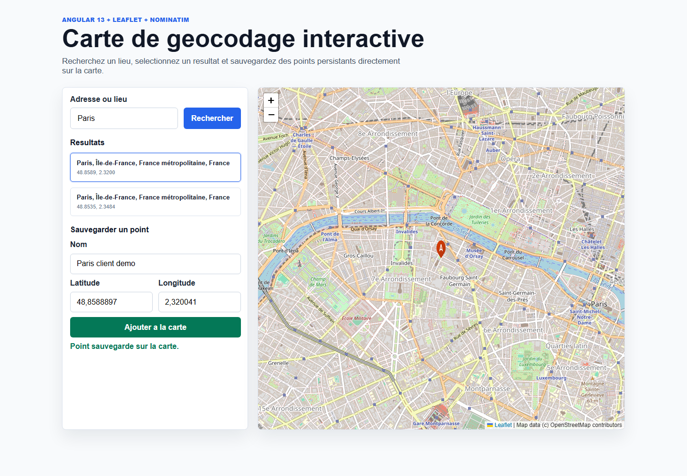

# Angular Leaflet Geocoding Map

An Angular 13 portfolio project that demonstrates geocoding, interactive maps,
component communication, reactive state, form validation and local persistence.

**Live demo:** https://benzina.github.io/angular-leaflet-geocoding-map/



## Features

- Address and place search powered by the OpenStreetMap Nominatim API.
- Visible loading, network error and empty-result states.
- Clickable search results that center the map and display a temporary marker.
- Save-point form with editable name, latitude and longitude.
- Form validation: required name, latitude between `-90` and `90`, longitude between `-180` and `180`.
- Persistent map markers saved in `localStorage`.
- Reactive Leaflet map integration with `@asymmetrik/ngx-leaflet`.
- Unit tests for geocoding, form validation and point persistence.
- MIT license.

## Tech Stack

- Angular `13.2`
- TypeScript `4.5`
- Leaflet `1.8`
- `@asymmetrik/ngx-leaflet`
- RxJS `7.5`
- Karma + Jasmine

## Architecture

The application intentionally separates responsibilities to make the Angular
data flow easy to understand and explain.

`AppComponent` acts as the container component. It owns the current search
state: results, selected result and whether a search has already been run.

`GeocodingComponent` owns the search input, calls Nominatim through
`HttpClient`, normalizes the response and emits the resulting locations with
`@Output`.

`ResultsListComponent` is presentational. It receives results with `@Input`,
renders empty/result states and emits the selected result with `@Output`.

`MapPointFormComponent` receives the selected result with `@Input`, pre-fills a
reactive form and saves valid points through `MapPointsService`.

`MapComponent` also listens to `MapPointsService`. The service exposes an
`Observable` backed by a `BehaviorSubject`, so the map updates automatically
whenever a new point is saved.

`MapPointsService` is the source of truth for saved points. It keeps the current
points in memory and persists them to `localStorage`, so markers survive page
reloads without requiring a backend.

## Nominatim API

Search requests use:

```text
https://nominatim.openstreetmap.org/search
```

The app only calls the API when the user submits the search form, which keeps
request volume reasonable for a demo. In browser-based frontend code, the
`User-Agent` header cannot be set manually; the deployed application is
identified publicly through its `Referer`.

## Installation

```bash
npm install
```

## Run Locally

```bash
npm start
```

Local application URL:

```text
http://localhost:4200/
```

## Available Scripts

```bash
npm start
```

Runs the Angular development server.

```bash
npm run build
```

Builds the application into `dist/angular-leaflet-geocoding-map`.

```bash
npm run watch
```

Builds in watch mode with the development configuration.

```bash
npm test -- --watch=false --browsers=ChromeHeadless
```

Runs the unit test suite in a local CI-style mode.

## Project Structure

```text
src/
  app/
    geocoding/             Nominatim search component
    map/                   Leaflet map and markers
    map-point-form/        Saved point form
    models/                Shared TypeScript models
    results-list/          Presentational search results list
    services/              Point state and persistence
    app.component.*        Container component
    app.module.ts          Main Angular module
  assets/
    marker-icon.png        Marker icon
```

## Deployment

The GitHub Pages build is published with `angular-cli-ghpages`.

Build command used for this repository:

```bash
npm run build -- --base-href /angular-leaflet-geocoding-map/
```

Publish the compiled folder:

```bash
npx angular-cli-ghpages --dir=dist/angular-leaflet-geocoding-map
```

## Possible Improvements

- Add editing and deletion for saved points.
- Replace `localStorage` with a persistent backend.
- Add debounce/rate limiting if search evolves into autocomplete.
